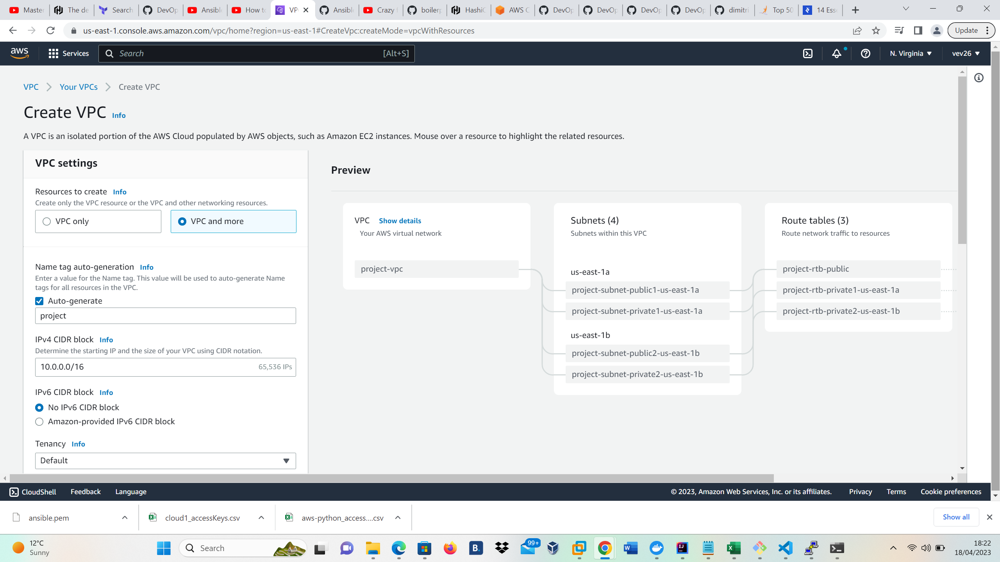

# AWS VPC with Subnet using Terraform

This project focus on designing virtual private cloud that contain private, public subnet and route table to connected to internet gateaway in AWS.

## Pre-requisites

* Terraform installed locally
* AWS account and keypair created in AWS
* Preferred IDE (I will use VS Code)
* AWS region: `us-east-1`

